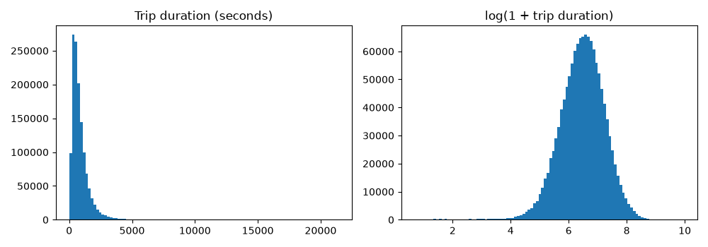
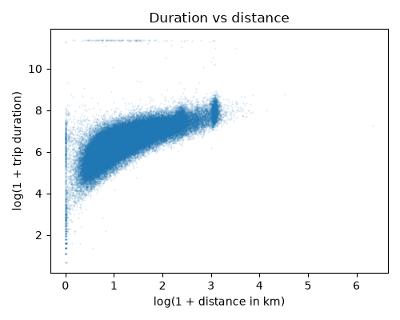

# Dataset Preprocessing

The figures and numbers below come from `TaxiTripDuration.ipynb`.

## Removed columns
- `id`: a unique identifier with no information about the trip.
- `dropoff_datetime`: the trip duration is exactly dropoff time minus pickup time, so using it would give away the answer.

## Target

Trip duration is very skewed: most trips take a few minutes, but a few take hours. The model therefore predicts
`log(1 + duration)`, which has a much more even distribution. Training trips longer than 6 hours are removed
as recording errors.

## Features
| Feature | Transformation |
|---|---|
| `vendor_id`, `passenger_count` | used as numbers |
| pickup and dropoff latitude/longitude | used as numbers |
| `store_and_fwd_flag` | "Y" → 1, "N" → 0 |
| distance | haversine distance between pickup and dropoff in km, then `log(1 + distance)` |
| hour, weekday, month | taken from `pickup_datetime` |

The distance between pickup and dropoff is clearly related to the trip duration, as the plot shows,
so it was added as a feature. The pickup time was split into hour, weekday and month, because traffic depends on the time.

## Normalization
All features are standardized using the mean and standard deviation of the training split, then clipped to [-5, 5].
The clipping is needed because a few coordinates are far outside New York and made training diverge.
The target is standardized in the same way.

## Comparison
The same model (one hidden layer of 32 nodes) was trained on both feature sets:

| Features | Best validation loss |
|---|---|
| Raw features only | 0.329 |
| Raw + distance and time features | **0.271** |

The engineered features give a lower validation loss, so they are used for all models.
